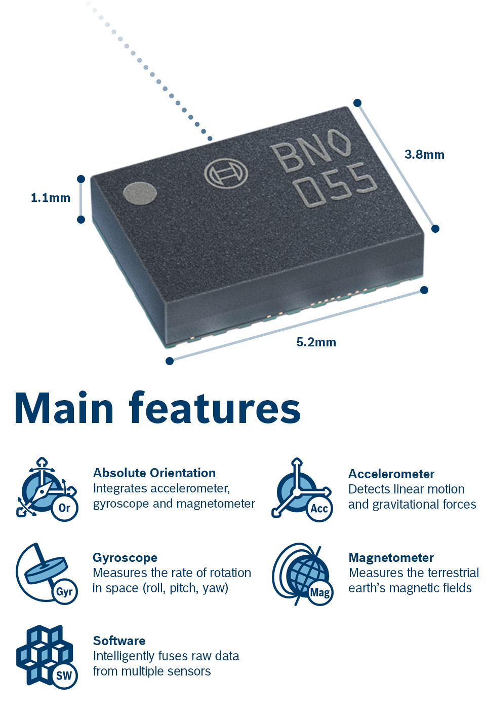

## Bosch Sensortec BNO055 embedded-hal driver




## What is this?

This is a [embedded-hal](https://github.com/rust-embedded/embedded-hal) driver for Bosch's inertial measurement unit (IMU) BNO055.

It is device-agnostic and uses `Write`/`WriteRead` (I2C) and `Delay` embedded-hal traits for its operation.

Uses and re-exports [nalgebra](https://www.nalgebra.org/)'s [Quaternion](http://toxiclibs.org/docs/core/toxi/geom/Quaternion.html) for quaternion reading and [Rotation3](https://www.nalgebra.org/rustdoc/nalgebra/geometry/type.Rotation3.html) for Euler angles.

## Usage

1. Add dependency to `Cargo.toml`:

    ```bash
    cargo add bno055
    ```
    
2. Instantiate and init the device:
    ```rust
    // ... declare and configure your I2c and Delay implementations ...
    
    // Init BNO055 IMU
    let imu = bno055::Bno055::new(i2c, delay);
    
    imu.init()?;
    
    // Enable 9-degrees-of-freedom sensor fusion mode with fast magnetometer calibration
    imu.set_mode(bno055::BNO055OperationMode::NDOF)?;
    
    Ok(imu)
    ```

3. Read orientation data: quaternion or euler angles (roll, pitch, yaw/heading)
    ```rust
    let quat = imu.quaternion()?;
    // or:
    let euler = imu.euler_angles()?;
    ```

## Setup details

### Device calibration

To calibrate device's sensors for first time:

```rust
use bno055::{BNO055Calibration, BNO055OperationMode, BNO055_CALIB_SIZE};

let bno055 = ...;

// Enter NDOF sensor fusion mode whic is also performing
// a calibration
bno055.set_mode(BNO055OperationMode::NDOF)?;

// Wait for device to auto-calibrate
while !bno055.is_fully_calibrated() {}

let calib = bno055.calibration_profile()?;

// Save calibration profile in NVRAM
mcu.nvram_write(BNO055_CALIB_ADDR, calib.as_bytes(), BNO055_CALIB_SIZE)?;
```

To load previously saved calibration profile:

```rust
use bno055::{BNO055Calibration, BNO055OperationMode, BNO055_CALIB_SIZE};

let bno055 = ...;

// Read saved calibration profile from MCUs NVRAM
let mut buf = [0u8; BNO055_CALIB_SIZE];
mcu.nvram_read(BNO055_CALIB_ADDR, &mut buf, BNO055_CALIB_SIZE)?;

// Apply calibration profile
let calib = BNO055Calibration::from_buf(buf);
bno055.set_calibration_profile(calib)?;
```

### Remapping axes to correspond your mounting

BNO055 allows to change default axes to meet chip orientation with
actual physical device orientation, thus providing possibility to place BNO055 
chip on PCB as suitable for designer and to match chip's axes to physical 
axes in software later.

```rust
use bno055::{AxisRemap, BNO055AxisConfig};
// ...

// Build remap configuration example with X and Y axes swapped:
let remap = AxisRemap::builder()
    .swap_x_with(BNO055AxisConfig::AXIS_AS_Y)
    .build()
    .expect("Failed to build axis remap config");
    
bno055.set_axis_remap(remap)?;
```

Please note that `AxisRemap` (and the chip itself) builder doesn't allow invalid state to be constructed,
that is, when one axis is swapped with multiple of others.
For example, swapping axis `X` with both `Y` and `Z` at the same time is not allowed:

```rust
AxisRemap::builder()
    .swap_x_with(BNO055AxisConfig::AXIS_AS_Y)
    .swap_x_with(BNO055AxisConfig::AXIS_AS_Z)
    .build()
    .unwrap(); // <- panics, .build() returned Err
``` 

### Changing axes sign

It is also possible to flip sign of either axis of the chip.

Example of flipping X and Y axes:

```rust
bno055
    .set_axis_sign(BNO055AxisSign::X_NEGATIVE | bno055::BNO055AxisSign::Y_NEGATIVE)
    .expect("Unable to communicate");
```

### Using external 32k crystal

For better performance, it is advised to connect and use external 32k quartz crystal.

User could enable or disable it by calling `set_external_crystal`:

```rust
bno055
    .set_external_crystal(true)
    .expect("Failed to set to external crystal");
```

### Using alternative I2C address

BNO055 allows to change its I2C address from default `0x28` to alternative `0x29` by setting
`COM3` pin `HIGH`.

To connect to device with alternative address, enable its use by calling `with_alternative_address()`:

```rust
let mut bno = bno055::Bno055::new(i2c, delay).with_alternative_address();
```

## Status

What is done and tested and what is not yet:

- [x] Sensor initialization
- [x] Device mode setup
- [x] Device status readout
- [x] Calibration status readout
- [x] External crystal selection
- [x] Axis remap
- [x] Axis sign setup
- [x] Calibration data readout
- [x] Calibration data setup
- [x] Alternative I2C address
- [ ] Orientation data readout
    - [x] Quaternions
    - [x] Euler angles
    - [ ] Raw accelerometer data readout
    - [ ] Raw gyroscope data readout
    - [ ] Raw magnetometer data readout
- [ ] Linear acceleration data readout
- [ ] Temperature readout
- [ ] Interrupts
